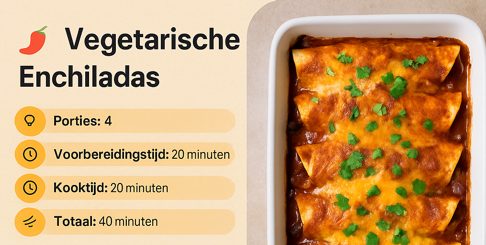

# 🌯 Vegetarische Enchiladas met Zwarte Bonen & Zoete Aardappel

**Porties:** 4  
**Voorbereidingstijd:** 20 minuten  
**Kooktijd:** 20 minuten  
**Totale tijd:** 40 minuten  
**Allergenen:** Bevat zuivel (cheddar) – makkelijk vegan te maken met plantaardige kaas

---

## 🧠 Weetje
Deze Mexicaanse klassieker combineert een **hartige vulling van zwarte bonen en zoete aardappel** met gesmolten kaas en enchiladasaus. Rijk aan vezels en eiwitten — ideaal comfortfood!

---

## 🥗 Ingrediënten

- 1 el olijfolie  
- 1 middelgrote zoete aardappel, geschild en in blokjes  
- 1 tl komijnpoeder  
- 1 tl paprikapoeder  
- Zout en peper naar smaak  
- 1 blik (400 g) zwarte bonen, uitgelekt en afgespoeld  
- 1 klein blikje maïs (optioneel)  
- 1 rode paprika, in blokjes  
- 8 kleine tortilla’s (maïs of tarwe)  
- 1½ kop (ongeveer 350 ml) enchiladasaus (kant-en-klaar of zelfgemaakt)  
- 1½ kop geraspte kaas (cheddar of vegan alternatief)  
- Verse koriander als topping (optioneel)

---

## 🔪 Instructies

1. **Verwarm de oven** voor op 200°C (boven- en onderwarmte).  
2. **Bak de vulling:**  
   - Verhit olijfolie in een pan en bak de zoete aardappel met komijn, paprika, zout en peper.  
   - Voeg na 5–7 min de zwarte bonen, paprika en maïs toe en bak 2 min mee.
3. **Rol de enchiladas:**  
   - Verdeel het mengsel over de tortilla’s, rol op en leg ze in een ingevette ovenschaal met de naad naar beneden.
4. **Werk af & bak:**  
   - Giet de enchiladasaus erover en strooi de kaas erover.  
   - Bak 15–20 min tot de kaas gesmolten is en de bovenkant goudbruin.

---

## 🍽️ Serveer Suggestie

- Top af met verse koriander, gesneden lente-ui of avocado.
- Serveer met rijst, guacamole of een frisse salade.

---

## ✅ Bewaartip

Restjes blijven 3 dagen goed in een afgesloten bakje in de koelkast.  
Opwarmen in de oven of magnetron.

---

