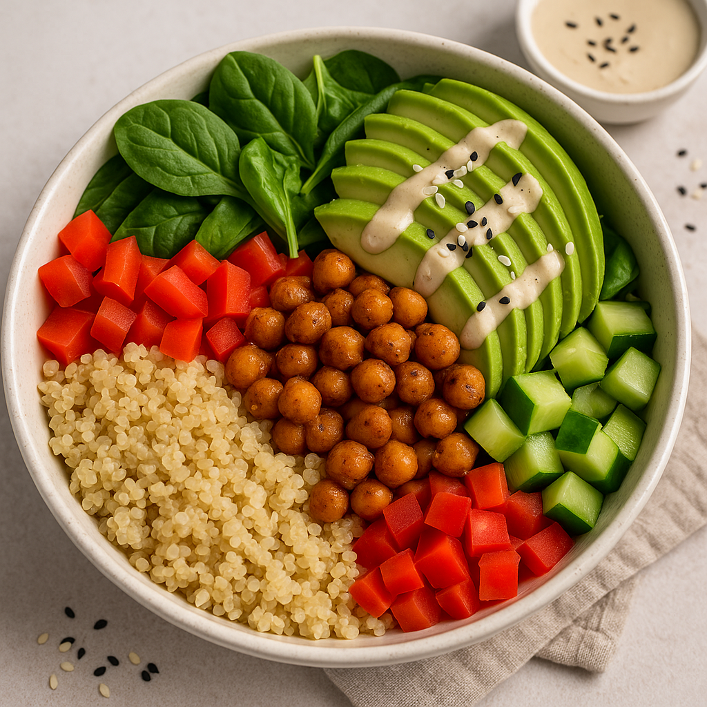

# 🌱 Chickpea & Quinoa Power Bowl (Vegan & Protein-Rich)

**Prep Time:** 10 minutes  
**Cook Time:** 20 minutes  
**Total Time:** 30 minutes  
**Servings:** 4  
**Protein per Serving:** ~20g  
**Calories per Serving:** ~480 kcal  
**Allergens:** None (nut-free, soy-free, gluten-free)

---

## 🧠 Educational Insight
**Quinoa** is one of the rare plant-based foods that contains all nine essential amino acids, making it a **complete protein**, perfect for vegan diets.

---

## 🥗 Ingredients

- 1 cup quinoa (dry)
- 2 cans chickpeas (15 oz each), drained and rinsed
- 1 large avocado, sliced
- 2 cups spinach or kale, chopped
- 1 red bell pepper, diced
- 1 medium cucumber, chopped
- 1/4 cup tahini
- 2 tbsp lemon juice
- 2 tbsp olive oil
- 1 tsp garlic powder
- 1/2 tsp cumin
- Salt & pepper to taste
- *Optional toppings:* sesame seeds, chili flakes, fresh herbs (parsley or cilantro)

---

## 🔪 Instructions

1. **Cook the quinoa:**  
   Rinse quinoa well. Combine with 2 cups water in a pot. Bring to a boil, reduce heat, cover, and simmer for 15 minutes. Fluff with a fork.  
   💡 *Tip:* Cook quinoa in vegetable broth for added flavor.

2. **Sauté chickpeas:**  
   In a skillet, heat 1 tbsp olive oil. Add chickpeas, garlic powder, cumin, salt, and pepper. Cook over medium heat for 5–7 minutes until golden.  
   💡 *Tip:* Let chickpeas sit undisturbed for a couple of minutes to crisp up.

3. **Make tahini dressing:**  
   Mix tahini, lemon juice, remaining olive oil, a pinch of salt, and 2–3 tbsp water in a bowl until smooth.

4. **Assemble bowls:**  
   Divide quinoa into 4 bowls. Top with chickpeas, greens, bell pepper, cucumber, and avocado.

5. **Finish with dressing and toppings.**  
   Drizzle tahini dressing and sprinkle with optional toppings.

---

## 🍽️ Nutritional Info (per serving)

- **Calories:** ~480 kcal  
- **Protein:** ~20g  
- **Carbohydrates:** ~42g  
- **Fat:** ~24g  
- **Fiber:** ~10g

---

## ✅ Allergen Notes
This recipe is free from common allergens. Always ensure cross-contamination is avoided during preparation if allergies are a concern.

---

