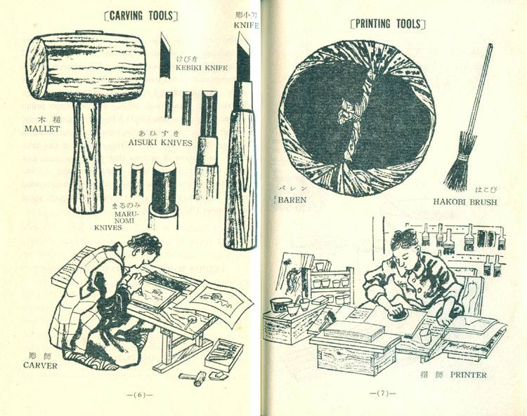
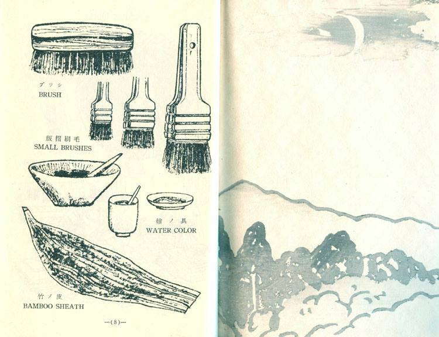
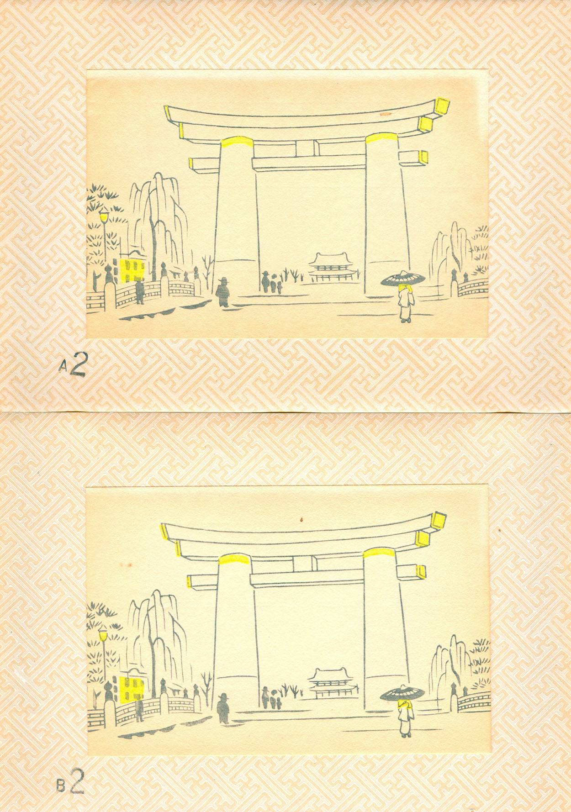
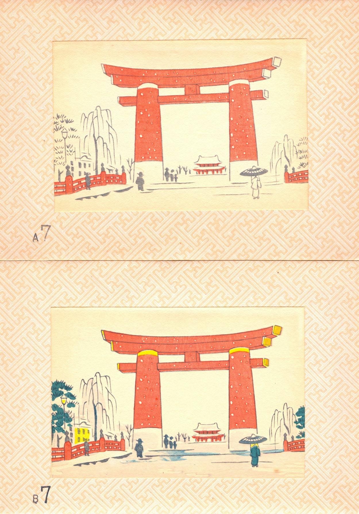
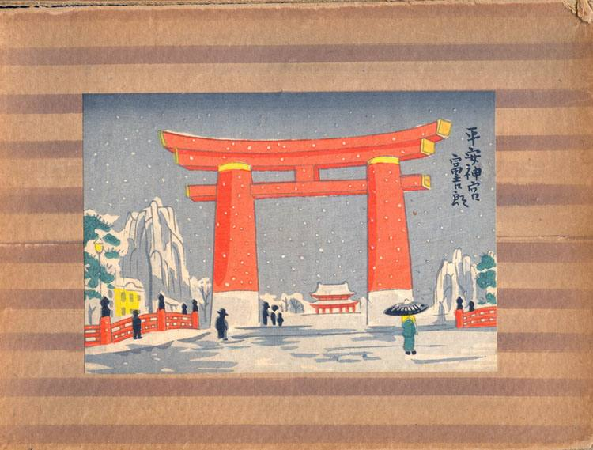

---

title: "Japanise wood block printing Uchida Co., Kyoto"
draft: false
date: 2021
description: "THE OUTLINE OF JAPANESE WOOD BLOCK PRINT"
---

# THE OUTLINE OF JAPANESE WOOD BLOCK PRINT

#### Kyoto, Uchida Wood Block Printing Co., LTD, undated but ca 1950

---

Here's an image:

![][image_ref_a32ff4ads]

More text here...
...
![image_ref_a32ff4ads](:data:image/svg+xml;base64,PHN2ZyB3aWR0aD0iMTQwIiBoZWlnaHQ9IjYwIiB2aWV3Qm94PSIwIDAgMTQwIDYwIiB4bWxucz0iaHR0cDovL3d3dy53My5vcmcvMjAwMC9zdmciIHhtbG5zOnhsaW5rPSJodHRwOi8vd3d3LnczLm9yZy8xOTk5L3hsaW5rIj4KICA8ZGVmcz4KICAgIDxwYXRoIGlkPSJhIiBkPSJNMCA1OS44MjFoMjQ2VjBIMHoiLz4KICA8L2RlZnM+CiAgPGcgZmlsbD0ibm9uZSIgZmlsbC1ydWxlPSJldmVub2RkIj4KICAgIDxwYXRoIGZpbGw9IiNDRDA2MzgiIGQ9Im0wIDAgMjYuODI2IDU5LjgyMSAxMDcuNDYzLTIzLjMwOVYweiIvPgogICAgPGc+CiAgICAgIDxwYXRoIGQ9Ik00MC42ODMgMTIuMTA1Yy00LjI4MiAwLTYuNDIyIDMuNDMtNi40MjIgMTAuMjkgMCAzLjQ4NS41MDUgNi4xNzMgMS41MTMgOC4wNjUgMS4wMSAxLjg5MiAyLjQ1NCAyLjgzOCA0LjMzNiAyLjgzOCAxLjAzNyAwIDIuMDE5LS4zOCAyLjk0Ni0xLjEzNyAxLjA2NC0uODY2IDEuOTIyLTIuMTM4IDIuNTc3LTMuODE2LjQ2NC0xLjM1MyAxLjAzNi0yLjAzIDEuNzE4LTIuMDMuNTQ1IDAgLjk2Ny4yMjQgMS4yNjkuNjcxLjMuNDQ5LjQ1IDEuMi40NSAyLjI1OHYuNjVjLS4wNTUuMzUzLS4wODIuNjExLS4wODIuNzczLS4xMSAxLjE0LS4yNzQgMS45MzMtLjQ5MSAyLjM4LS4yMTguNDQ4LS42NTUuOTE1LTEuMzA5IDEuNDA0LTEuNTU1Ljg0LTIuMzczIDEuMjc1LTIuNDU1IDEuMzAxLTEuNzQ2Ljc2LTMuNDUgMS4xNC01LjExMyAxLjE0LTMuMjQ2IDAtNS44MzctMS4yODctNy43NzMtMy44Ni0xLjkzNy0yLjU3Mi0yLjkwNC02LjAzNi0yLjkwNC0xMC4zOTIgMC00LjE5MSAxLjAwMi03LjU4OCAzLjAwNi0xMC4xODggMi4wMDUtMi42IDQuNjMtMy45IDcuODc1LTMuOS41NDYgMCAxLjA0My4wNDEgMS40OTMuMTIyLjQ1LjA4MiAxLjM0My4zMTQgMi42OC42OTUuNDYzLjE2My44NDUuMjQ0IDEuMTQ1LjI0NC4wODIgMCAuNDM2LS4wNjcgMS4wNjQtLjIwNC42MjctLjEzNSAxLjAyMi0uMjA0IDEuMTg3LS4yMDQuOSAwIDEuMzUuNzkgMS4zNSAyLjM2OGwuMTYzIDUuMTM0YzAgMS4zMTUtLjUwNSAxLjk3Mi0xLjUxMyAxLjk3Mi0uOTgzIDAtMS41NDMtLjQ5Mi0xLjY3OS0xLjQ3OS0uMjczLTEuOTQ1LS43NTYtMy4yOC0xLjQ1MS00LjAwNy0uNjk2LS43MjUtMS44ODktMS4wODgtMy41OC0xLjA4OE03MS4zNzQgMTIuNTU1bC0xLjY4LS4wMDFjLTEuODA2IDAtMi43MDctLjU5Mi0yLjcwNy0xLjc3NSAwLS40NTguMTY0LS44MzQuNDkxLTEuMTNhMS43MDYgMS43MDYgMCAwIDEgMS4xODYtLjQ0NGg3LjJjMS4yODIgMCAxLjkyMi42NCAxLjkyMiAxLjkyIDAgLjU0NS0uMTc3LjkxOC0uNTMxIDEuMTIyLS4zNTYuMjA0LTEuMDM3LjMwNy0yLjA0Ni4zMDdsLTIuODY1IDIyLjU4MWMtLjE2MyAxLjM2MS0uOTUzIDIuMDQyLTIuMzcgMi4wNDItLjU3NCAwLTEuMDEyLS4xMS0xLjMxLS4zMjctLjQwOS0uMy0uNzc3LS45NTMtMS4xMDUtMS45NmwtMy4zNTQtOS41OTYtMy4yMzIgOS42NzhjLS40ODMgMS40Ny0xLjM1NSAyLjIwNS0yLjYxNiAyLjIwNS0xLjM5NiAwLTIuMi0uNzYyLTIuNDE2LTIuMjg3bC0zLjQzNi0yMi4zMzZjLS45IDAtMS41NDctLjE0NC0xLjk0Mi0uNDI5LS4zOTYtLjI4Ni0uNTk0LS43MTUtLjU5NC0xLjI4NiAwLS40OS4xOTEtLjg4NS41NzMtMS4xODQuMzgyLS4zLjg4Ni0uNDUgMS41MTQtLjQ1aDcuMjRjMS4xMTggMCAxLjY3Ny41MTEgMS42NzcgMS41MzMgMCAxLjIxLS43MiAxLjgxNi0yLjE1OSAxLjgxNmwtMS40NjYtLjAwMiAyLjE3NiAxNi4yOTcgMi42OTktOC4wOGMuNDM1LTEuMjg0IDEuMTAyLTEuOTI3IDItMS45MjcuOTggMCAxLjY4Ni42MzkgMi4xMjIgMS45MTVsMy4xOTIgOC44ODQgMS44MzctMTcuMDg2Wk05My41MzUgMTIuNTU0SDkwLjUxdjIwLjMzNWg0LjcwNGMuNTE4IDAgLjk0Ny4xNTcgMS4yODkuNDcuMzQuMzEzLjUxMi43MjguNTEyIDEuMjQ2IDAgLjQ5LS4xNzkuODg1LS41MzIgMS4xODQtLjM1NS4zLS44MDYuNDQ5LTEuMzUuNDQ5SDgxLjQ2OGMtLjU3MyAwLTEuMDM3LS4xNS0xLjM5LS40NDktLjM1Ni0uMy0uNTMyLS43Mi0uNTMyLTEuMjY2IDAtLjQ5LjE2My0uODg0LjQ5LTEuMTg0LjMyNy0uMy43NzctLjQ1IDEuMzUtLjQ1SDg1LjZWMTIuNTU0aC00LjM3NmMtLjQ5MiAwLS44OTYtLjE1Ny0xLjIwOS0uNDctLjMxMy0uMzEyLS40Ny0uNzE0LS40Ny0xLjIwNCAwLS41MTcuMTY0LS45MjUuNDkxLTEuMjI1LjMyNy0uMy43NzctLjQ1IDEuMzUtLjQ1aDEzLjAwOGMxLjI1NSAwIDEuODgyLjU0NSAxLjg4MiAxLjYzNCAwIC42OC0uMTk4IDEuMTM3LS41OTMgMS4zNjgtLjM5Ni4yMzEtMS4xMTEuMzQ3LTIuMTQ4LjM0NyIgZmlsbD0iI0ZFRkVGRSIvPgogICAgICA8bWFzayBpZD0iYiIgZmlsbD0iI2ZmZiI+CiAgICAgICAgPHVzZSB4bGluazpocmVmPSIjYSIvPgogICAgICA8L21hc2s+CiAgICA8L2c+CiAgPC9nPgo8L3N2Zz4K)

Japanese Wood Block Prints
Uchida Wood Block Printing Co., Kyoto

---

A wood block print was derived from China, but
the technique in itself had made remarkable progress
since it was brought to Japan. In the primitive days,
a simple design was carved on a small piece of wood,
and putting some indian ink on the surface of the wood
they pressed it on a sheet of paper. In order to have
a larger print, they stamped many such small designs on
the same paper. They gradually wanted to print a larger
design on the paper but realized it difficult to stamp it
with a large wood block on which such design was carved.
Putting a wood block on a stand they tried to rub the
paper placed on the wood block. This is a basic way
of printing a modern Japanese wood block print.

In the Ashikaga era (1603—1867 A. D.) and before
days, a wood block print was only a black and white
one, or on which painted with a hair-brush. 

In the beginning of the Tokugawa age, however, 

the color-printing was created and made tremendous progress, until the
golden age of Ukiyoe prints.

With the advent of the printing machinery in the
Meiji era, (1867—1911 A. D.), the wood-print lost its
raison d'être for practical use, but remained as an artistic
printing. Today, it is considered one of the most artistic
creations in the Japanese paintings.

Now, let us explain in brief the process making
a wood block print.

First of all, an original picture is drawn by an
artist, and then handed over to the sculpturer. 

According to the process of Ukiyoe printing, an original painter
trace the lines of his picture on the thin paper. A carver,
then, puts it upon the well planed cherry board (some
times box tree is used), and starts his work according
to the lines of the black and white drawing. A carver
mainly uses a small sharp knife for his work, which is
smaller than a quarter of an inch wide. Besides this,
round chisels, Masuki and Komasuki chisels are used
to make the board to be a relief printing. The slender
line of Ukiyoe printing is carved only by this small knife.

On completion of the wood block for the printing
the outline of an original picture, it is possible to reprint
it on many sheets of paper. As these black and
white prints are to be used for the carving material,
a thin paper is to be used by a printer then, which are
the same with the one drawn by a painter at first. An
original painter divides various kinds of color used in
his original painting to each thin paper. For an original
picture of five different colors, for example, he provides
five sheets of such paper for a carver. Putting these
paper to each different wood block, an engraver cuts five
different wood blocks according to them. That is to
say, he carves wood blocks as many as the variety of
the number of colors and shadings of an original paint-
ing. In order to print each color precisely, they put
the corner and the edge of the paper to the inside of
the “L” and “—” marks carved on the end of each
wood block. The tool which is used to rub the back
side of paper is named “BAREN,” which is made of
bamboo sheath and pure Japanese paper. A vertical coil of
strings twisted with two or three pieces of bamboo fiber
is attached to the thick cover made of Japanese paper,
and they are wrapped together with bamboo sheath.

Japanese paper is the only paper for the wood block
printing, which is made from paper mulberry. Liquid
of gelatin and alum is used to coat the bark surface of
paper, which will be dried hanging on the ropes, then a
printer gives touches to them again when he wants to
print on them. As to the material of the color, they
use water color paint which is made from natural mi-
nerals, and sometimes vegetable dyes too. The blue
shading such as we often see in the works of Hiroshige
is made by the peculiar technique with a brush, cotton
fiber and water.

Thus, a Japanese wood block print is made by the
combined effort of a painter, a carver and a printer.
To become a skillful carver or printer of a wood block
print, it requires untired effort and indefatigable mind
for more than ten years, and still more to be an ex-
perienced original painter. A carver studies to carve
short straight lines first, next, long straight lines, and
then curved complicated lines. In the golden age of
Ukiyoe, for instance, an experienced carver used to
engrave the face and the hair of a woman, while a
beginner carved the other parts of the woman.

A printer's work is very hard as well as that of
a carver. The brush used for the printing is made of
hard horse main. A new brush is to be put over the
fire to make its surface smooth. The surface of brush are
also rubbed against a shark skin to be made smoother,
until it becomes as soft as velvet. A brush can not
be said to be perfect until it is through all processes
mentioned above.

A well trained printer goes to a factory to work
with his self-made “baren,” which is so indispensable
for him that a master of the factory can easily imagine
how his technique is, watching how he makes his baren.
An original painter of wood block print is required not
only to be a well trained artist but also to be familiar to
the technique making wood block prints. It must be
to him to know how he originates a painting to be suitable
to the wood block print. It may be able to reproduce
an ordinary picture but it can not be a creative wood
block print. A real wood block print should not be a
reproduction of hand painting but it must be the result
of an idea originated by such special painter in order
to make the wood block print. The landscape prints
originated by Hiroshige, Mt. Fuji by Hokusai, and actors'
portraits by Kiyomasu and Sharaku are all painstaking
masterpieces, but not mere a reproduction of the paint-
ings. At present it is true that there are some imi-
tation of the old wood block prints but many creative
wood block prints are now being produced by true-minded
artists in Japan, to hand over the traditional merit point
of Japanese Ukiyoe prints.

---

---

### Example of how the colors are added

### Final result of all the added colors

---

Source of this file can be found [here](https://github.com/Benjamin-Italiaander/My_Notes/tree/main/slices_of_life/art_i_enjoy/Wood_Block_Printing_Uchinda)
