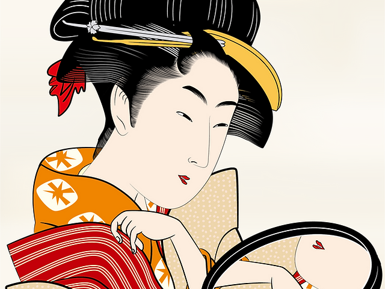

# Discovering Takamizawa Mokuhansha and the Art of Japanese Lithography

During my search for *Takamizawa Mokuhansha*, a Japanese wood-block print publisher, I came across the website of **George C. Baxley**, who shared some wonderful images showing how lithographs and wood-block prints are made.  

On his site, he states:

> “Any person is hereby authorized to view, copy, print and distribute this document subject to the following conditions:  
> – The document may be used for personal informational purposes only;  
> – The document may only be used for non-commercial purposes;  
> – Any copy of this document, or any portion thereof, must include this copyright notice.”

Based on that, I believe I’m allowed to use some of these beautiful images from his site to illustrate how the different wood-block and lithographic prints were created.  

Baxley’s website also includes a fascinating history of the **Fujiya Hotel**, complete with images, drawings, and lithographs.  
Altogether, I decided to keep these here because I really enjoy them and want to share them — especially the Japanese art, which I find particularly inspiring.  

---

## About Takamizawa Mokuhansha (高見沢木版社)

### Origins & Background  
Takamizawa Mokuhansha (高見沢木版社) was a **Tokyo-based publisher** specializing in *mokuhanga* (木版画, wood-block printing).  
The company appears to have been founded or led by brothers **Masuro Takamizawa** and **Tadao Takamizawa** (高見沢 忠雄).  
Active roughly from the **1930s through the 1980s**, the firm was renowned for **high-quality colour reproductions** of classical ukiyo-e prints as well as a number of original designs.

Their reproductions often included complete sets of historic works, such as **Hiroshige’s _The 53 Stations of the Tōkaidō_**, rendered with remarkable fidelity.  
Prints by Takamizawa were typically marked with the company’s seal “高見沢木版社”, which confirmed authenticity and separated them from lower-quality reproductions of the era.

### Significance  
Takamizawa Mokuhansha played an important role in preserving and popularizing **traditional Japanese printmaking** during the 20th century.  
Their studio combined the craftsmanship of hand-carved blocks and hand-printed colours with modern distribution, allowing global audiences to experience the beauty of classic ukiyo-e designs.

---

## Selected Works from Takamizawa Mokuhansha

### 🌸 1. Floral Print — Cherry Blossoms (c. 1950s)
  
**Publisher:** Takamizawa Mokuhansha (Tokyo)  
**Date:** circa 1950s  
**Medium:** Colour wood-block print on *washi* paper  
**Description:** A delicate depiction of cherry blossoms in bloom.  
**Notes:** Demonstrates the publisher’s refined *bokashi* (gradient shading) and subtle colour layering typical of mid-century Takamizawa prints.  

---

### 🗻 2. The 53 Stations of the Tōkaidō – Scene I
  
**Original Artist:** Utagawa Hiroshige (1797 – 1858)  
**Publisher:** Takamizawa Mokuhansha  
**Edition:** Post-war reprint, ca. 1950  
**Series:** *The 53 Stations of the Tōkaidō* (東海道五十三次)  
**Notes:** One of the finest post-war reproductions of Hiroshige’s classic travel series, faithfully carved and printed by Takamizawa artisans.  

---

### 🌊 3. The 53 Stations of the Tōkaidō – Scene II
  
**Original Artist:** Utagawa Hiroshige  
**Publisher:** Takamizawa Mokuhansha  
**Date:** ca. 1950  
**Medium:** Multi-colour wood-block print  
**Notes:** Another example from the same reprint series, showing Takamizawa’s exceptional attention to linework and registration precision.  

---

### 🉐 4. Publisher’s Seal – Takamizawa Mokuhansha (高見沢木版社)
  
**Imprint:** 高見沢木版社 / Takamizawa Mokuhansha  
**Usage:** Found on genuine Takamizawa editions (margin or verso)  
**Purpose:** Confirms the publisher’s authenticity and distinguishes true Takamizawa works from later reproductions.  

---

## Closing Thoughts  

Exploring Takamizawa Mokuhansha’s prints deepened my appreciation for how Japan’s wood-block tradition continued well into the modern era.  
Each piece connects classical artistry with 20th-century craftsmanship — a quiet testament to how art forms evolve yet remain timeless.

---

*All images and quoted text are used for non-commercial, educational purposes, in accordance with the copyright statement provided by George C. Baxley.*

