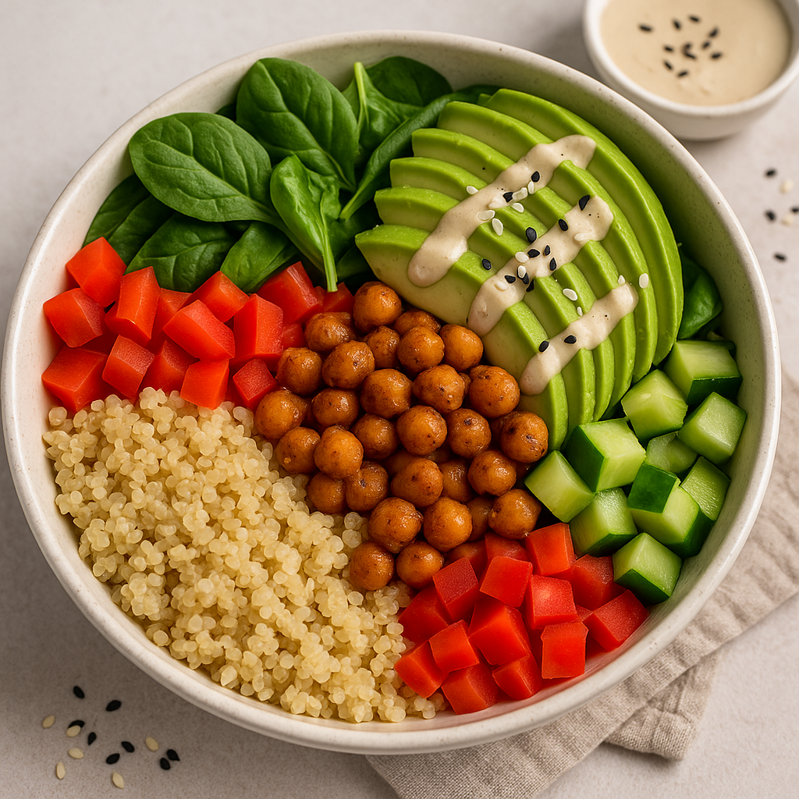

# 🌱 Kikkererwten & Quinoa Power Bowl (Vegan & Eiwitrijk)

**Bereidingstijd:** 10 minuten  
**Kooktijd:** 20 minuten  
**Totale tijd:** 30 minuten  
**Porties:** 4  
**Eiwit per portie:** ~20g  
**Calorieën per portie:** ~480 kcal  
**Allergenen:** Geen (noten-, soja- en glutenvrij)

---

## 🧠 Interessant Weetje
**Quinoa** is één van de weinige plantaardige voedingsmiddelen die alle negen essentiële aminozuren bevat. Het is dus een **volwaardige eiwitbron**, ideaal voor veganisten.

---

## 🥗 Ingrediënten

- 1 kop quinoa (ongekookt)
- 2 blikken kikkererwten (400 g elk), afgespoeld en uitgelekt
- 1 grote avocado, in plakjes
- 2 kopjes spinazie of boerenkool, grof gehakt
- 1 rode paprika, in blokjes
- 1 middelgrote komkommer, gehakt
- 60 ml tahin (sesampasta)
- 2 eetlepels citroensap
- 2 eetlepels olijfolie
- 1 theelepel knoflookpoeder
- 1/2 theelepel komijn
- Zout en peper naar smaak
- *Optionele toppings:* sesamzaadjes, chilivlokken, verse kruiden (peterselie of koriander)

---

## 🔪 Instructies

1. **Kook de quinoa:**  
   Spoel de quinoa goed af. Kook met 2 kopjes water in een pan. Breng aan de kook, zet dan het vuur lager, dek af en laat 15 minuten sudderen. Roer los met een vork.  
   💡 *Tip:* Kook quinoa in groentebouillon voor extra smaak.

2. **Bak de kikkererwten:**  
   Verhit 1 eetlepel olijfolie in een pan. Voeg kikkererwten, knoflookpoeder, komijn, zout en peper toe. Bak 5–7 minuten op middelhoog vuur tot ze licht krokant zijn.  
   💡 *Tip:* Laat ze een paar minuten onaangeroerd liggen in de pan voor een mooie goudbruine korst.

3. **Maak de tahindressing:**  
   Meng tahin, citroensap, resterende olijfolie, een snufje zout en 2–3 eetlepels water in een kom tot een gladde saus.

4. **Stel de bowls samen:**  
   Verdeel de quinoa over 4 kommen. Voeg de kikkererwten, bladgroenten, paprika, komkommer en avocado toe.

5. **Werk af met dressing en toppings.**  
   Druppel de tahindressing erover en strooi optionele toppings eroverheen.

---

## 🍽️ Voedingswaarde (per portie)

- **Calorieën:** ~480 kcal  
- **Eiwitten:** ~20g  
- **Koolhydraten:** ~42g  
- **Vetten:** ~24g  
- **Vezels:** ~10g

---

## ✅ Allergeneninfo
Dit recept is vrij van veelvoorkomende allergenen. Zorg altijd voor schone werkoppervlakken en vermijd kruisbesmetting indien allergieën een rol spelen.

---

