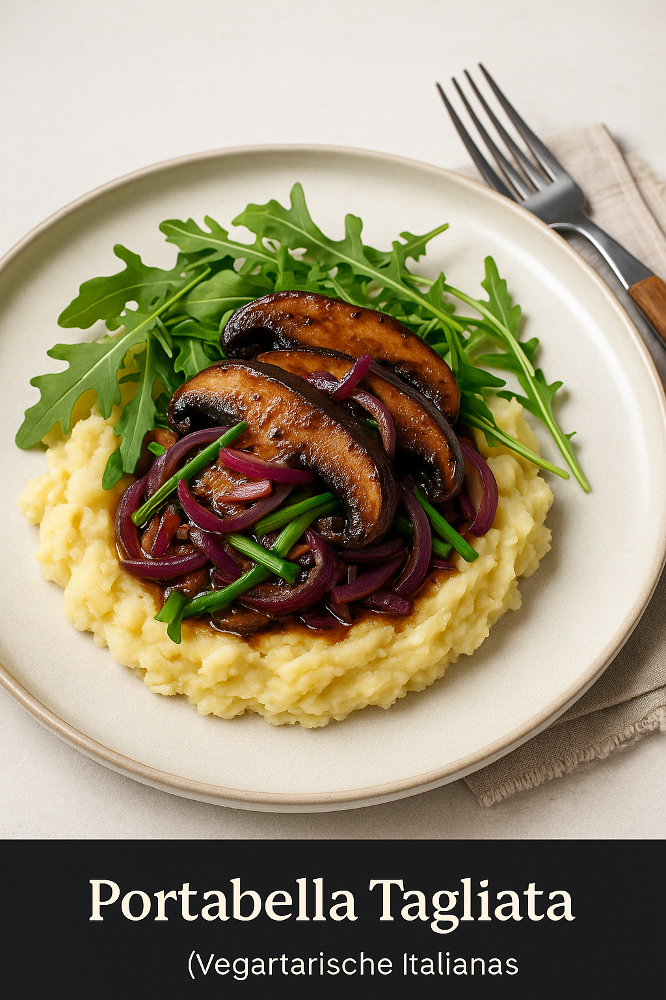

# 🌿 Portabella Tagliata (Vegetarische Italiaanse Stijl)

**Bereidingstijd:** 30 minuten  
**Porties:** 4  
**Vegan:** ✅ Ja  
**Allergenen:** Bevat soja (tamari of sojasaus)

---

## 🧠 Educatief Weetje
**Portabella’s** zijn eigenlijk volwassen champignons met een robuuste structuur en diepe umamismaak. Door hun formaat en bite zijn ze een perfecte vleesvervanger, ideaal voor vegetarische versies van klassieke gerechten zoals tagliata.

---

## 🛒 Ingrediënten

### 🥬 Groenten & Verse Producten
- 2 teentjes knoflook *(Irjimpa SL Demeter)*
- 1 limoen, rasp & sap *(Fairtrasa)*
- 6 portabella’s *(’t Paddestoelenrijk)*
- 1000 g zilte aardappelen *(Waddengebied)*
- 800 g pastinaak *(de eerste)*
- 3 rode uien *(TVA Organics)*
- 1 bosje bosui *(Biolatina)*
- 100 g rucola *(Snijderij Udea)*

### 🧂 Zelf Toevoegen
- 6 el olijfolie
- 4 el tamari of sojasaus
- Snufje zout en (chili)peper

---

## 👩‍🍳 Bereidingswijze

1. **Maak de marinade:**  
   Pel de knoflook. Rasp de schil van de limoen en pers het sap uit. Meng in een kom: olijfolie, tamari, uitgeperste knoflook, limoensap, zout en chilipeper.

2. **Marineer de portabella:**  
   Veeg de portabella’s schoon en snijd in dikke plakken. Wentel door de marinade of bestrijk met een kwastje. Laat intrekken terwijl je de rest voorbereidt.

3. **Maak de puree:**  
   Breng een pan met gezouten water aan de kook. Schil of was de aardappelen en pastinaak, snijd in gelijke stukken. Kook 20 min gaar, giet af (bewaar kookvocht). Stamp met wat kookvocht tot een smeuïge puree. Breng op smaak met zout en peper.  
   💡 *Tip:* Voeg een scheutje olijfolie toe voor extra romigheid zonder zuivel.

4. **Bak de groenten:**  
   Pel de ui en snijd in halve ringen. Snijd de bosui in staafjes. Verhit olie in een pan (of 2) en bak de portabella’s met ui en bosui bruin op middelhoog vuur. Blus af met overgebleven marinade.

5. **Serveren:**  
   Verdeel de puree over borden. Leg er een handje rucola op. Schep de gebakken portabella en jus er royaal overheen.

---

## 🍽️ Voedingswaarden (per portie, geschat)
- **Energie:** ± 430 kcal  
- **Eiwitten:** ± 10g  
- **Koolhydraten:** ± 45g  
- **Vetten:** ± 20g  
- **Vezels:** ± 8g

---

## ✅ Allergenentip
Bevat **soja** (in tamari of sojasaus). Gebruik *kokosamino's* als alternatief bij soja-allergie. Zorg voor aparte snijplanken als er allergieën zijn in huis.

