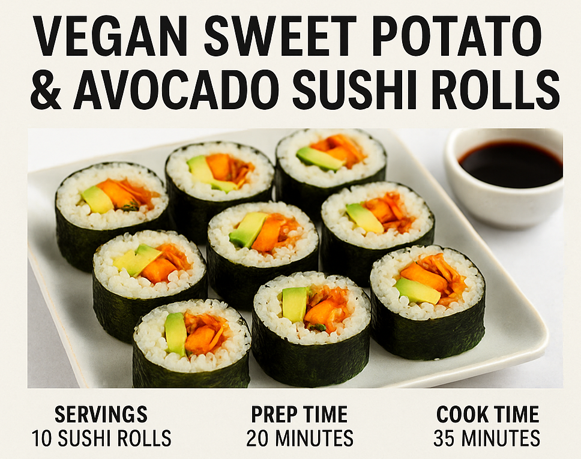

# 🍣 Vegan Zoete Aardappel & Avocado Sushirollen

**Porties:** 10 sushirollen  
**Bereidingstijd:** 20 minuten  
**Kooktijd:** 35 minuten  
**Totale tijd:** 55 minuten  
**Allergenen:** Mogelijk soja (indien aanwezig in kimchi)

---

## 🧠 Interessant Weetje

Sushi is niet alleen voor visliefhebbers! Deze kleurrijke en smaakvolle sushirollen combineren **umami van kimchi**, **romigheid van avocado**, en **zoete, geroosterde aardappel**. Een populaire keuze in plantaardige fusion-keukens!

---

## 🥗 Ingrediënten

- 4 kopjes gekookte sushirijst (van 2 kopjes droge sushirijst)
- 1/4 kop rijstazijn  
- 1 eetlepel suiker  
- 1 theelepel zout  
- 2 middelgrote zoete aardappelen, geschild en in dunne reepjes gesneden  
- 2 theelepels olijfolie  
- Zout en peper naar smaak  
- 2 kleine avocado’s, in dunne plakjes  
- 1/3 kop vegan kimchi, in dunne repen  
- 10 vellen nori (zeewier)

---

## 🔪 Instructies

1. **Verwarm de oven voor** op 200°C.  

2. **Zoete aardappel roosteren:**  
   
   - Leg de reepjes op een bakplaat.  
   - Besprenkel met olijfolie, zout en peper.  
   - Hussel goed en rooster 25–30 minuten. Halverwege keren voor gelijkmatige bruining.

3. **Rijst op smaak brengen:**  
   
   - Meng rijstazijn, suiker en zout in een kommetje tot alles is opgelost.  
   - Voeg toe aan de warme gekookte rijst en meng voorzichtig.

4. **Sushi rollen:**  
   
   - Leg een vel nori op een bamboemat of een schone theedoek.  
   - Verdeel 1/4 van de rijst over het nori, laat bovenste rand vrij (ongeveer 2 cm).  
   - Leg in het midden de geroosterde zoete aardappel, avocado en kimchi.  
   - Rol strak op met natte handen.  
   - Snijd de rol in 6–8 stukjes met een scherp, natgemaakt mes.

---

## 🍽️ Voedingswaarde (per rol)

- **Calorieën:** ±210 kcal  
- **Eiwit:** ±4 g  
- **Koolhydraten:** ±30 g  
- **Vet:** ±7 g  
- **Vezels:** ±4 g

---
