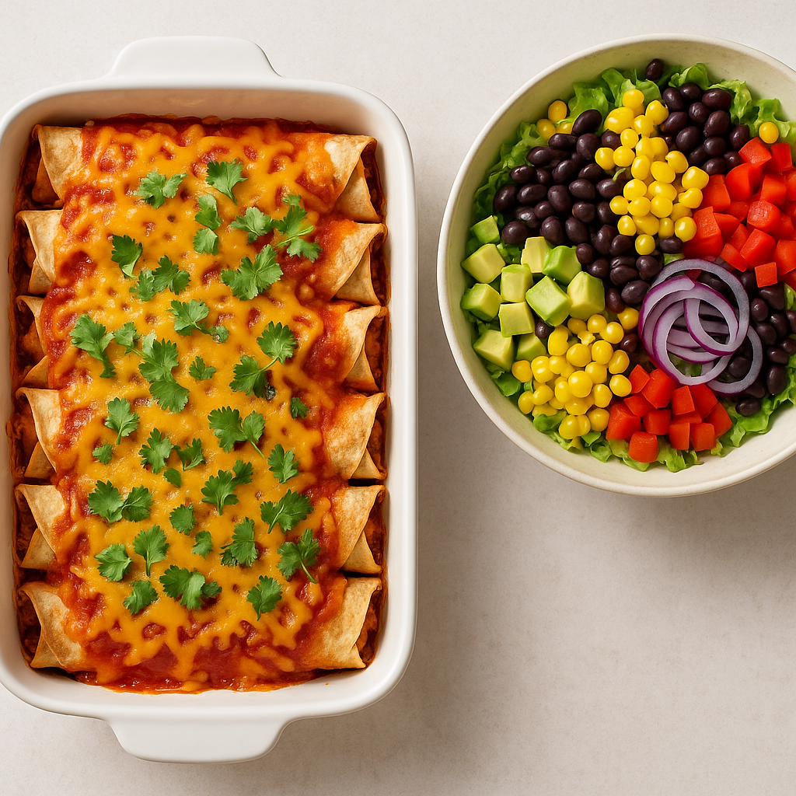

# 🇲🇽 Mexican Vegetarian Meal Bundle  
## 🌯 Veggie Enchiladas + 🥗 Mexican Salad

---

## 🌯 Vegetarian Enchiladas with Veggies & Cheddar

**⏱️ Prep Time:** 30 minutes  
**🍽️ Servings:** 4  
**🌱 Vegetarian – vegan adaptable**

---

### 🧠 Quick Insight  
This easy vegetarian enchilada recipe is a fresh twist on a Mexican classic. Instead of meat, it’s filled with a hearty blend of vegetables, corn, tomatoes, and Mexican spices, topped with sour cream and grated cheddar. **Ready in just 30 minutes!**

---

### 🥗 Ingredients

#### Core:
- 1 red onion  
- 1 clove garlic  
- 1 yellow bell pepper  
- 2 tsp Mexican spice mix  
- 70 g tomato paste  
- 200 g fresh tomatoes  
- 200 g canned corn, drained  
- 4 tortilla wraps (whole wheat or fiber-rich)  
- 65 ml sour cream  
- ½ bunch fresh cilantro  
- 75 g grated cheddar  

#### Pantry:
- 2 tbsp oil  
- 50 ml water  
- Pinch of salt and (chili)pepper  

---

### 🔪 Instructions

1. **Preheat the oven** to 200°C (392°F).  
2. **Chop** onion, garlic, and bell pepper.  
3. **Sauté** onion and garlic in oil for 2 minutes. Add bell pepper, tomato paste, and Mexican spices. Cook for 4 minutes.  
4. Add chopped tomatoes, corn, and 50 ml water. Let simmer uncovered for 5 minutes. Season with salt and pepper.  
5. **Spread sour cream** on each tortilla, add veggie filling and cilantro, roll up, and place in a baking dish.  
6. Top with remaining sauce and grated cheese.  
7. **Bake for 15 minutes** until cheese is melted and golden.

---

### 🍋 Serving Tip

Squeeze some **fresh lime or lemon** juice over the top for a zesty finish!

---

## 🥗 Fresh Mexican Salad

**⏱️ Prep Time:** 15 minutes  
**🍽️ Servings:** 4  
**🌱 100% vegan**

---

### 🧠 Quick Insight  
A colorful and vibrant salad full of beans, vegetables, and a light lime dressing. Perfect side dish for any Mexican main!

---

### 🥗 Ingredients

- 1 head romaine lettuce (or iceberg), shredded  
- 1 can (400 g) black beans, rinsed  
- 1 can corn (optional)  
- 1 red bell pepper, diced  
- 1 small red onion, thinly sliced  
- 1 avocado, diced  
- Juice of 1 lime  
- 2 tbsp olive oil  
- Salt and pepper to taste  
- Fresh cilantro or parsley (optional)

---

### 🔪 Instructions

1. Combine all veggies and beans in a large bowl.  
2. Whisk together lime juice, olive oil, salt, and pepper for the dressing.  
3. Pour over the salad and toss gently.

---

### 🍴 Serving Suggestion

- Serve alongside enchiladas, tacos, or burritos.  
- Also great with **tortilla chips** as a scoopable salad!

---

## ✅ Vegan Adaptation

To make the enchiladas fully vegan:
- Use **plant-based sour cream**  
- Use **vegan grated cheese**

The salad is already completely plant-based!

---

