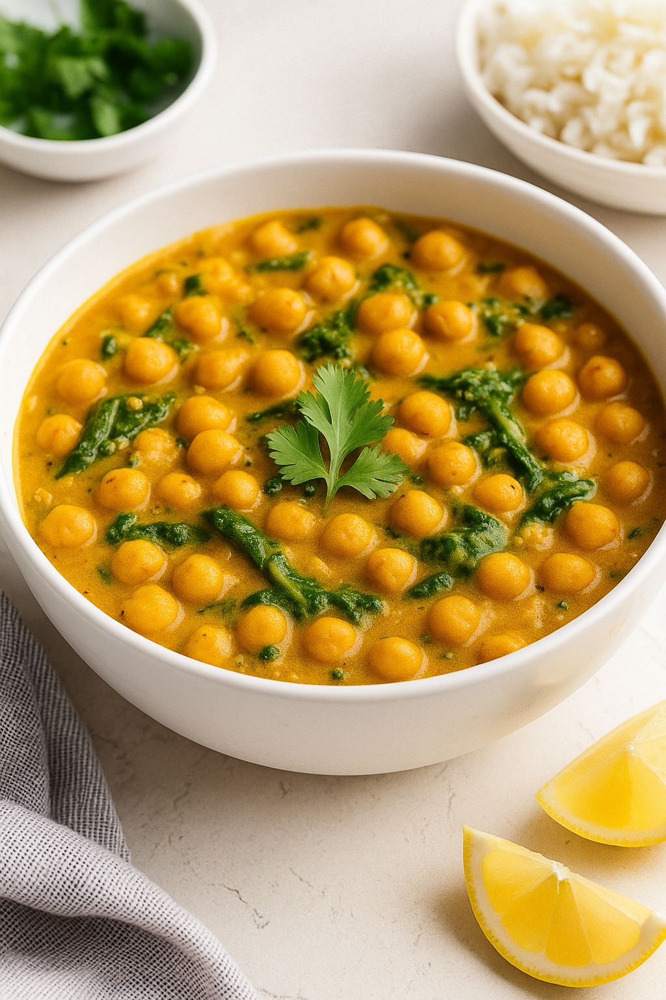

# 🥥🌿 Chickpea & Spinach Coconut Curry

## 📝 Ingredients:

- 1 tbsp olive oil  
- 1 medium onion, finely chopped  
- 3 cloves garlic, minced  
- 1 tbsp grated ginger (optional)  
- 1½ tbsp curry powder  
- 1 can (14 oz) coconut milk  
- 1 can (14 oz) diced tomatoes (optional for tang)  
- 2 cans (14 oz each) chickpeas, drained and rinsed  
- 4 cups fresh spinach (or 1½ cups frozen)  
- Salt and pepper to taste  
- Juice of ½ lemon (optional)  
- Fresh cilantro for garnish (optional)  
- Cooked rice or naan to serve  

---

## 🍳 Instructions:

1. **Sauté the aromatics**  
   Heat olive oil in a large skillet over medium heat. Add the chopped onion and cook for 4–5 minutes until soft and translucent.

2. **Add garlic, ginger, and curry powder**  
   Cook for 1 minute until fragrant.

3. **Pour in coconut milk and tomatoes**  
   Stir to combine. Bring to a simmer. Let it cook for 5 minutes.

4. **Add chickpeas and spinach**  
   Stir in the chickpeas and cook for 10 minutes. Add spinach during the last 2–3 minutes and let it wilt.

5. **Season and finish**  
   Add salt and pepper to taste. Squeeze lemon juice for brightness, if using.

6. **Serve**  
   Spoon over rice or scoop up with warm naan. Garnish with cilantro if desired.

---

## 🍽️ Nutritional Info (per serving, approx):

- Calories: 390 kcal  
- Protein: 13g  
- Carbs: 35g  
- Fat: 22g  
- Fiber: 9g  
- Iron: 30% DV  
- Vitamin A: 80% DV  

> *Note: Based on typical ingredients, actual values may vary.*

---

## ⚠️ Allergen Disclaimer:

- **Contains coconut (tree nut family)**
- Easily made **gluten-free** with rice
- **Dairy-free & vegan** by default  
- Substitute coconut milk with cashew cream or oat milk + 1 tsp cor
